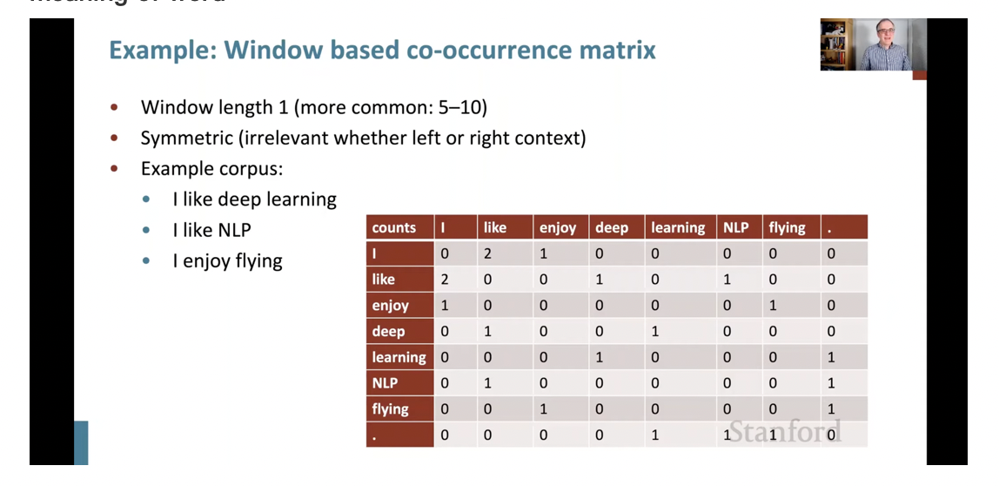
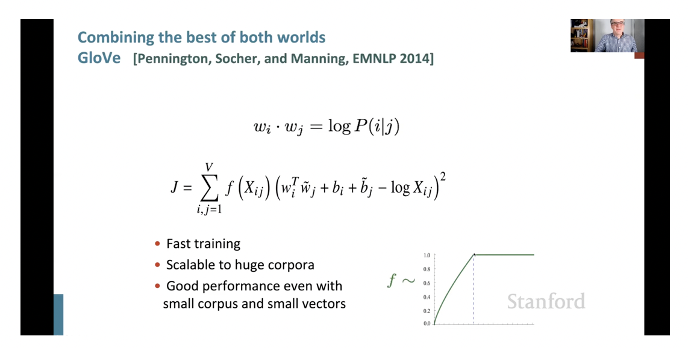
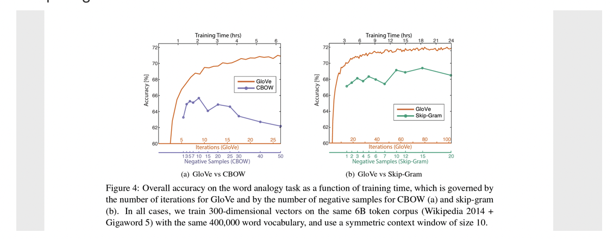

# Disheng's work 
---------
# Pytorch Basics 

[Key note of neural nerwork  in Pytorch](https://github.com/DishengLL/disheng-s_work/blob/main/liu_disheng_working/weekly%20report/week1/pytorch%20in%20TL.key)

* Dataflow in neural network
  input, forward propagation, (softmax), loss, backward propagation, optimization, parameters update 

* Components of defining a neural network in Pytorch
  network structure, input  and output(shape), activation function, loss function, optimizor

* Basic data format ——**tensor** 
  Tensors are similar to [NumPy’s](https://numpy.org/) ndarrays, except that tensors can run on GPUs or other hardware accelerators.

  it is easier to do complex operations in tensor than Numpy.

* AUTOMATIC DIFFERENTIATION—— **TORCH.AUTOGRAD**
  pytorch can automatically calculate **DIFFERENTIATION** for all of parameters in the network, and use them in back propagation.

There are reasons you might want to disable gradient tracking:

- * To mark some parameters in your neural network as **frozen parameters**. 
  - This is a very common scenario for [finetuning a pretrained network](https://pytorch.org/tutorials/beginner/finetuning_torchvision_models_tutorial.html)---HTL
  - To **speed up computations** when you are only doing forward pass,
  -  because computations on tensors that do not track gradients would be more efficient

( **Attention**: tensor.grad.zero_()

  In [PyTorch](https://github.com/pytorch/pytorch), for every mini-batch during the *training* phase, we typically want to explicitly set the gradients to zero before starting to do back propragation.

  Because PyTorch *accumulates the gradients* on subsequent backward passes. 

  This accumulating behaviour is convenient while training RNNs or when we want to compute the gradient of the loss summed over multiple *mini-batches* )

# Metamap Lite
  [Instruction of installing and running MateMap Lite](https://github.com/DishengLL/disheng-s_work/blob/main/liu_disheng_working/Metamap%20Lite_instruction%20.docx)

# Embedding (supervised & unsupervised)

## Word2vec (negative sampling) ---**2013**
  supervised method:   
   *  skip-grams      
   * CBOW (Continuous Bag of Words)      

* ### theory

* ### code
   [**implement**](https://github.com/DishengLL/disheng-s_work/blob/main/liu_disheng_working/Disheng_code/word2vec.ipynb)

## Bert ---**2018**
  

* ### theory
  [Paper](https://arxiv.org/pdf/1810.04805.pdf)    
  [PPT of Hung-yi Lee](recourse/BERT%20(v3).pdf)
  [Youtube](https://www.youtube.com/watch?v=UYPa347-DdE)   

  Bidirectional Encoder Representations from Transformers--(aka BERT)

  Actually, Bert embedding is an encoder section in  Transformer model published by Google.

  Bert encoder model uses Attention scheme to catch the relationship among words, which allows model to consider  distant context when processing each token.

  Overall, Bert Embedding uses pre-trained model, fed by sentence, and get parameters in hidden layers as the vector representation for each token.

* ### code
  In fact, BERT developers created two main models:
  The BASE: Number of transformer blocks (L): 12, Hidden layer size (H): 768 and Attention heads(A): 12       
  The LARGE: Number of transformer blocks (L): 24, Hidden layer size (H): 1024 and Attention heads(A): 16       
  the following code example use Base Version to extract word embedding.   

   [**implement**](https://github.com/DishengLL/disheng-s-work/blob/public/liu_disheng_working/Disheng_code/BERT%20Word%20Embeddings.ipynb)

   [reference](https://towardsdatascience.com/nlp-extract-contextualized-word-embeddings-from-bert-keras-tf-67ef29f60a7b)

## GloVe---**2014**
unsupervised method (leverlage co-occurrence information)

In NLP field, it is common understanding that the meaning of specific word is defined by its context.

so **why not use co-occurrence count (word-word matrix)  to represent the meaning of word**

**problem of using co-occurrence matrix directly**:
1. sparse
2. very high dimensions

* ### theory:  
  GloVe (Global Vectors) 
  > 'GloVe is an unsupervised learning algorithm for obtaining vector representations for words. Training is performed on aggregated global word-word co-occurrence statistics from a corpus, and the resulting representations showcase interesting linear substructures of the word vector space.'

  **GloVe model** leverages co-occurrence information, generating dense  word vector.

  **'the global corpus statistics are captured directly by the model'**

  **comparing with word2vec**

* ### useful links

  [**Stanford Official website**](https://nlp.stanford.edu/projects/glove/)   
  [**Original Paper**](https://aclanthology.org/D14-1162.pdf)

* ### code

  [**implement**](https://github.com/DishengLL/disheng-s_work/blob/main/liu_disheng_working/Disheng_code/GloVe.ipynb)

## Topic model
unsupervised method
1. LSA(Latent semantic analysis)
2. SVD(Singular value decomposition) 

